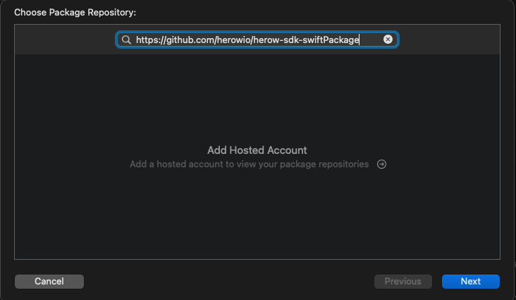
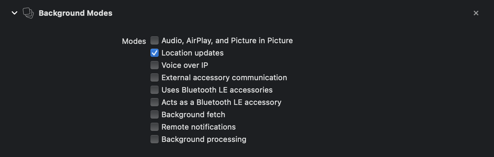

<h1 align="center">Herow SDK for iOS</h1>

<p align="center">
  
  <a href="https://github.com/herowio/herow-sdk-ios/workflows/Build%20and%20Test/badge.svg?">
	
  </a>
</p>

# SDK Setup - GitHub Packages

In order to use our SDK you need to configure your Github account.

## Installation with CocoaPod

* Install CocoaPods  ```$ gem install cocoapods```

* At the sample repository' root, check if a **Podfile** already exists, if not, create it. This can be done by running: ```$ touch Podfile```

* Add the following parameters to your Podfile:

```
source 'https://github.com/CocoaPods/Specs.git'
source 'https://github.com/herowio/Specs'

platform :ios, '11.0'

target 'YourtTarget' do
  use_frameworks!
  pod 'Herow', '~> 7.2.0'
  # Pods for QuickComplete

  # Pods for testing
  target 'QuickStartTests' do
    inherit! :search_paths
  end
  
  # Pods for testing UI
  target 'QuickStartUITests' do
    inherit! :search_paths
  end

	post_install do |installer|
        installer.pods_project.targets.each do |target|
            target.build_configurations.each do |configuration|
                configuration.build_settings['SWIFT_VERSION'] = "5.0"
                configuration.build_settings['SUPPORTS_UIKITFORMAC'] = 'NO'
                configuration.build_settings['SUPPORTS_MACCATALYST'] = 'NO'
            end
        end
    end

end
```

* Run ```$ pod update``` in your project directory


>Note:
>
>Your project is linked to the CoreLocation and CoreData frameworks
<br>

# SwiftPackage Installation

* open Xcode swift package Manager and enter the following url:

 **https://github.com/herowio/herow-sdk-swiftPackage**



# Configure the SDK

## Initialize the SDK

Inside the AppDelegate:

* Import the HerowConnection module
<br> 

```
import herow_sdk_ios
```

* Add a HerowInitializer parameter to your AppDelegate

```
var herowInitializer: HerowInitializer?
```


* In the **didFinishLaunchingWithOptions** method, initialize and configure the **HerowInitializer** object with your SDK Access Key (SDK ID & an SDK Key) & environment, and launch synchronization with the **Herow Platform**


```
var herowInitializer: HerowInitializer?
```
```
func application(_ application: UIApplication, didFinishLaunchingWithOptions launchOptions: [UIApplication.LaunchOptionsKey: Any]?) -> Bool {
    herowInitializer = HerowInitializer.instance
    herowInitializer?.configPlatform(.prod).configApp(identifier: "your SDK ID", sdkKey: "your SDK Key").synchronize()
    return true
}
```

>Note 1:
>
>The synchronize method allows the SDK set up with a configuration file downloaded from the Herow platform. The SDK will start the place detection process only when the file download is complete.

>Note 2:
>
>The HerowInitializer allows you to configure your access to the HEROW platform. HEROW gives you access to the following environments:
>
>- PRE_PROD: pre-production environment used for tests
>- PROD: production environment used for release

>Warnings:
>
>- You will get one Access Key: This Access Key is composed of an SDK ID & an SDK Key and is used to configure your SDK.
>
>- Please make sure you use the right platform depending on your objective (test or release). Otherwise your SDK won't load/be synced with the right content.

# GDPR Opt-ins

The HEROW SDK has an in-built mandatory GDPR method.

**Update the opt-ins permissions**

```
 HerowInitializer.instance.acceptOptin() // Opt-in accepted
 or
 HerowInitializer.instance.refuseOptin() // Opt-in refused
```

>Note: The HEROW SDK will only work if the GDPR opt-ins are given by the end-users.

# Location permissions

The HEROW SDK requires access to the Operating System permissions to work.

To access user's continuous location in the background, you need the **always** permission. The **whenInUse** permission will allow you to access the user's position in the foreground AND  in the background if using the **clickAndCollect** feature.

Anyway, you will need to declare background mode in Xcode.


In addition, the operating sytem requires the application to provide descriptions as of the level of permission required.

These descriptions can be configured in the **info.plist** file, by adding the following keys:

* The three keys for the location permission

```xml
<key>NSLocationAlwaysAndWhenInUseUsageDescription</key>
<string>Your app should state here the reason (with clear user benefit) for using foreground and background location.</string>

<key>NSLocationWhenInUseUsageDescription</key>
<string>Your app should state here the reason (with clear user benefit) for using foreground location.</string>

<key>NSLocationAlwaysUsageDescription</key>
<string>Your app should state here the reason (with clear user benefit) for using background location.</string>
```
> **Note**:
>HEROW has an in-built **ClickAndCollect** method enabling you to perform temporary background location with access to foreground permission only. More information in our **ClickAndCollect** section.
>

We provide methods for requesting permissions directly through the sdk.

```
HerowInitializer.instance.getPermissionsManager().requestLocation(.always, completion: nil)
   
HerowInitializer.instance.getPermissionsManager().requestLocation(.whenInUse, completion: nil)
```

# Asking for notifications
We  provide methods for requesting permissions directly through the sdk but you can ask by yourself 
```
HerowInitializer.instance.getPermissionsManager().requestNotificationPermission(completion: nil) 
```

# Setting a Custom ID

To set a custom ID, make the following call as soon as the user logs in.
If the user logout, you can use the removeCustomId method.

```
HerowInitializer.instance.setCustomId("customId")

HerowInitializer.instance.removeCustomId()
```

# Setting a customUrl

To set a customUrl to reach custom backEnd, make the following call

```
HerowInitializer.instance.setProdCustomURL("customProdUrl")
HerowInitializer.instance.setPreProdCustomURL("customProdUrl")
```

To remove  customUrls, make the following call
```
HerowInitializer.instance.removeCustomURL()
```

To check  currentUrl, make the following call
```
let currentURL = HerowInitializer.instance. getCurrentURL()
```

# ClickAndCollect

To enable the HEROW SDK to continue **tracking end-users location events** (such as geofences' detection and position statements) happening in a **Click & Collect context** when the app is in the background (but not closed).

This method is to be **called during an active session** (app open) which will enable the SDK to **continue tracking the end-user when the app is put in background.** 

>**Note 1:**
>
> This method only works if the end-user's runtime location permission is at least set to **While in use**.
>
>Apple prevents apps requesting the **Always** Location Runtime Permission from collecting background location data before the user grants the full location permission. 

>**Note 2:**
>
> By default, the **Click & Collect background service will timeout after 2 hours**. This is meant to preserve the initial objective of this feature to locate end-users in the background for Click & Collect scenarios and not provide continuous background tracking.

**How to start Click and Collect**

```
HerowInitializer.instance.launchClickAndCollect()
```

**How to stop Click and Collect**


```
HerowInitializer.instance.stopClickAndCollect()
```


# IDFA Access

From iOS 14+, the OS requires authorization to access the **IDFA** (ID For Advertisers) 

First you have to put this line in your plist file
```xml
<key>NSUserTrackingUsageDescription</key>
<string>App would like to access IDFA for tracking purpose</string>
```
and HEROW provides a native method to facilitate its collection.
```        
HerowInitializer.instance.getPermissionsManager().requestIDFA(completion: nil)
```
>Note: 
>This method has no effect on the core SDK features and is therefore **not mandatory**.


# Debug Mode
You can now follow the execution logs with this method.

// add description
```        
GlobalLogger.shared.startDebug()
```
// add description

```        
GlobalLogger.shared.stopDebug()
```
// add description

```        
GlobalLogger.shared.registerLogger(logger: HerowLogger())
```


